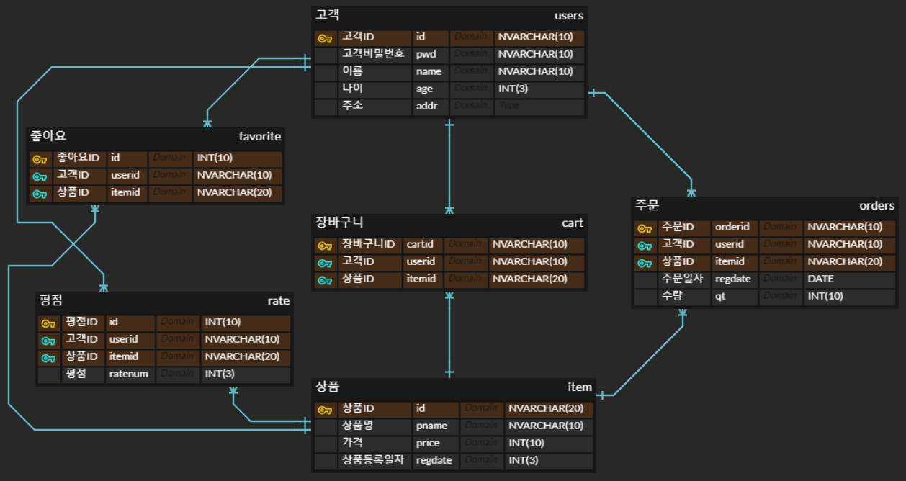

# MariaDB 정리

> 1. 기본 내용
> 2. DDL/DML/DCL


## 1. 기본 내용

* 테이블은 데이터를 입력하기 위해 표 형태로 나타낸 것을 뜻하고 데이터베이스는 테이블의 저장소를 의미한다. DBMS는 데이터베이스를 관리하는 시스템 또는 소프트웨어이다.
  * 각 테이블은 열로 구성되고 행은 실질적인 데이터를 의미한다.
  * 기본 키 열은 각 행을 구분하는 유일한 열을 의미한다.
* MariaDB는 기본적으로 테이블 이름, 열 이름 등을 모두 소문자로 처리하고 SQLite 문구는 대문자로 처리한다.
* 데이터베이스 튜닝은 데이터베이스의 성능을 향상시키거나 응답하는 시간을 단축시키는 것이다.
   * 쿼리에 대한 응답을 줄이려면 인덱스를 적절히 활용해야 한다.


## 2. DDL/DML/DCL

```mariadb
DROP TABLE item;

CREATE TABLE item (
	id INT AUTO_INCREMENT PRIMARY KEY,
	name NVARCHAR(10) NOT NULL,
	code CHAR(5) UNIQUE,
	price INT,
	regdate DATE
);

ALTER TABLE item AUTO_INCREMENT = 1000;
INSERT INTO item VALUES (NULL,'상품이름은바지입니다',11115,1000,CURRENT_DATE);
INSERT INTO item VALUES (NULL,'aaaaaaaaaa',11129,1000,CURRENT_DATE);
SELECT * FROM item;
```

 * 테이블을 만들 때에는 다음과 같다. CREATE TABLE 테이블 이름 (각 변수의 이름 및 형태);
    * NVARCHAR(10)는 데이터를 출력할 때 공백을 제거하는 기능을 하므로 CHAR(10) 형식보다 처리속도가 느릴 수 있다. 
      	* 오라클 및 일반적인 프로그래밍 언어에서는 영문을 1바이트, 한글을 2바이트로 인식하지만 MariaDB와 같이 UTF-8로 지정했을 때에는 영문과 한글을 모두 1바이트로 받아들인다.
   	* 실수 형식은 FLOAT, 정수 형식은 INT이 된다.
    * 날짜 형식은 DATE가 되고 크기를 지정하지 않는다.
      	* CURRENT_DATE는 MariaDB가 인식한 현재 시간을 자동으로 선택한다.
       * 기본 값으로 '연월일' 순으로 날짜를 인식한다.
         	* 날짜 변수의 데이터 입력형식은 기본적으로 'oooooooo', 또는 'oooo-oo-oo'이 된다. 
 * 제약 조건은 데이터 무결성을 지키기 위한 것을 의미하며 여기에는 PRIMARY KEY, FOREIGN KEY, UNIQUE, CHECK, DEFAULT, NULL이 있다.
    * NULL을 쓴 것과 쓰지 않은 것은 차이가 없다.
    * ATUO_INCREMENT는 자동으로 변수가 1씩 증가하는 기능을 하므로 반드시 형식이 숫자일 때에만 쓸 수 있다. 해당 변수가 None이면 변수에 1이 들어간다.
       * 삭제한 데이터에 대해선 관련 변수를 자동으로 채우지 않는다.
 * PRIMARY KEY는 적용하려는 변수를 기본 키 변수로 설정한다.
   	* UNIQUE도 PRIMARY KEY와 마찬가지로 관련 변수를 기본 키 변수로 하는 기능을 하지만 변수 값에 NULL을 허용한다.

```mariadb
DROP TABLE IF EXISTS product;
CREATE TABLE IF NOT EXISTS product(
	Pcoid CHAR(3) NOT NULL,
	Pserial CHAR(4) NOT NULL,
	pname NVARCHAR(10) NOT NULL,
	pprice INT(10) NOT NULL,
	qt INT(10) NOT NULL
);

ALTER TABLE product ADD CONSTRAINT mypk PRIMARY KEY (Pcoid,Pserial);
ALTER TABLE product ALTER COLUMN pprice SET DEFAULT 10000;
ALTER TABLE product ADD CONSTRAINT mycheck CHECK (qt > 0);
ALTER TABLE product ADD CONSTRAINT myunique UNIQUE (pname);

INSERT INTO product VALUES ('111','1111','p1',pprice);

SELECT * FROM product;

ALTER TABLE product DROP CONSTRAINT mycheck;  # 제약조건을 제거users
```

 * CREATE 문구는 될 수 있으면 단순하게 한다.
   	* NOT NULL은 될 수 있으면 입력한다.
    * 추가 조건은 ALTER를 이용한다.
      	* 데이블을 수정할 단계 및 수준을 줄일 수 있으며 원천적으로 잘못된 데이터의 삽입을 막을 수 있다.
      	* AUTO_INCREMENT와 PRIMARY KEY를 동시에 설정한 후에 다시 ALTER로 기본 키 설정을 하면 오류가 발생한다. 따라서 CREATE 문구에서 AUTO_INCREMENT와 UNIQUE로 지정하고 ALTER에서 PRIMARY KEY 설정을 해야한다. 
       * 각 테이블에 기본 키는 CREATE 문구에서 1개만 설정할 수 있다. 그러나 ALTER를 이용하면 2개 이상을 기본 키로 지정할 수 았다.
         	* 이 경우에, 기본 키 변수의 값이 모두 동일할 때에만 행을 구분할 수 있다.
 * ALTER TABLE 구문은 다음과 같다.
   	* (1) ALTER TABLE 테이블 이름
    * (2) ADD CONSTRAINT 제약 이름
      	* 제약조건 이름은 전체 데이터베이스 내에서 서로 달라야 한다.
    * (3) 설정하려는 제약조건 (테이블 내 변수 이름 또는 조건)
      	* PRIMARY KEY (Pcoid,Pserial);
      	* CHECK (qt > 0);
      	* SET DEFAULT 10000;

```mariadb
CREATE TABLE IF NOT EXISTS users(
	id CHAR(4),
	pwd NVARCHAR(10),
	NAME NVARCHAR(20)
);
ALTER TABLE users ADD CONSTRAINT uers_pk PRIMARY KEY (id);
CREATE TABLE IF NOT EXISTS items(
	id INT(10) AUTO_INCREMENT PRIMARY KEY,
	name NVARCHAR(20),
	price INT(5),
	regdate DATE
);

ALTER TABLE items AUTO_INCREMENT = 1000;

# DML

SELECT * FROM users;
SELECT * FROM items;

INSERT INTO items VALUES (id, 'item05',10000,CURRENT_DATE);

INSERT INTO users (id,name) VALUES ('id01','james');
INSERT INTO users VALUES('id02','pwd02','kim');

# DELETE FROM items; 해당 테이블에 있는 모든 정보가 삭제 / 복구도 할 수 없다
DELETE FROM items WHERE id  = 1001;

# UPDATE items SET name = 'item05'; 해당 테이블에 있는 모든 name 변수가 item05로 바뀐다
UPDATE items SET name = 'item06', price = 15000, regdate = '20201018' WHERE id = 1002;
```

 * INSERT 구문에서 입력하려는 변수를 미리 지정하지 않은 채 VALUES를 입력하면 모든 변수에 대한 정보를 입력해야 한다.
   	* 이 경우에, 입력하지 않은 변수에서는 NULL이 삽입된다.
	* 'DESC 테이블 이름'을 통해 테이블의 구조를 알 수 있다.

```mariadb
# Relational

SELECT * FROM items;
desc items;
SELECT * FROM users;
desc users;

DROP TABLE IF EXISTS cart;
CREATE TABLE cart(
	id INT(10) AUTO_INCREMENT PRIMARY KEY,
	userid CHAR(4),
	itemid INT(10),
	regdate DATE,
	qt INT(10)
);

ALTER TABLE cart
ADD CONSTRAINT user_fk FOREIGN KEY (userid) REFERENCES users(id);
ALTER TABLE cart
ADD CONSTRAINT item_fk FOREIGN KEY (itemid) REFERENCES items(id);

INSERT INTO cart VALUES (id, 'id01', '1003',CURRENT_DATE,4);
SELECT * FROM cart;
```


```mariadb
# Relational

SELECT * FROM items;
desc items;
SELECT * FROM users;
desc users;

DROP TABLE IF EXISTS cart;
CREATE TABLE cart(
	id INT(10) AUTO_INCREMENT PRIMARY KEY,
	userid CHAR(4),
	itemid INT(10),
	regdate DATE,
	qt INT(10)
);

ALTER TABLE cart
ADD CONSTRAINT user_fk FOREIGN KEY (userid) REFERENCES users(id);
ALTER TABLE cart
ADD CONSTRAINT item_fk FOREIGN KEY (itemid) REFERENCES items(id);

INSERT INTO cart VALUES (id, 'id01', '1003',CURRENT_DATE,4);
SELECT * FROM cart;

SELECT * FROM cart
INNER JOIN users ON cart.userid = users.id
INNER JOIN items ON cart.itemid = items.id;

SELECT c.id, c.regdate, u.id, u.name, i.name, i.price FROM cart c
INNER JOIN users u ON c.userid = u.id
INNER JOIN items i ON c.itemid = i.id;
```

	* 테이블 간 관계를 설정하지 않으면 초기 설계와 부합하지 않는 데이터가 입력된다.
 * 왜래 키와 기본 키를 ALTER TABLE 구문을 통해 동시에 설정할 수 있다.
   	* (1) ALTER TABLE 테이블 이름
   	* (2) ADD CONSTRAINT 제약 이름
   	* (3) FOREIGN KEY (왜래 키 설정 테이블의 관련 변수 이름) REFERENCES 참조하려는 테이블의 이름 (변수 이름)


# Workshop 

> 1. ERD 이미지
> 2. DDL/DML 작성
> 3. 참고


## 1. ERD 이미지



	* ERD(Entity relationship Diagram)Cloud에서 작업을 할 때, 테이블의 첫 번째 이름은 의사소통을 위한 명칭(한글)이고 두 번째는 실제 DBMS에서 사용하는 테이블의 이름(영어)을 의미한다.
	* 노란색은 기본 키 변수, 파란색은 일반 변수를 의미한다.


## 2. DDL/DML 작성

```mariadb
# DDL

CREATE TABLE users (
	id NVARCHAR(10) NOT NULL,
	pwd NVARCHAR(10) NOT NULL,
	name NVARCHAR(10) NOT NULL,
	age INT(3) NOT NULL,
	addr NVARCHAR(30) NOT NULL
);
ALTER TABLE users ADD CONSTRAINT users_pk PRIMARY KEY (id);

DESC users;

CREATE TABLE items (
	id NVARCHAR(20) NOT NULL,
	pname NVARCHAR(20) NOT NULL,
	price INT(10) NOT NULL,
	regdate DATE NOT NULL
);
ALTER TABLE items ADD CONSTRAINT items_pk PRIMARY KEY (id);

DESC items;

CREATE TABLE cart (
	cartid NVARCHAR(10) NOT NULL,
	userid NVARCHAR(10) NOT NULL,
	itemid NVARCHAR(20) NOT NULL
);
ALTER TABLE cart ADD CONSTRAINT cart_pk PRIMARY KEY (cartid);
ALTER TABLE cart ADD CONSTRAINT users_fk FOREIGN KEY (userid) REFERENCES users(id);
ALTER TABLE cart ADD CONSTRAINT items_fk FOREIGN KEY (itemid) REFERENCES items(id);

DESC cart;

DROP TABLE orders;

CREATE TABLE orders (
	orderid NVARCHAR(10) NOT NULL,
	userid NVARCHAR(10) NOT NULL,
	itemid NVARCHAR(20) NOT NULL,
	regdate DATE NOT NULL,
	qt INT(10) NOT NULL
);
ALTER TABLE orders ADD CONSTRAINT orders_pk PRIMARY KEY (orderid);
ALTER TABLE orders ADD CONSTRAINT users2_fk FOREIGN KEY (userid) REFERENCES users(id);
ALTER TABLE orders ADD CONSTRAINT items2_fk FOREIGN KEY (itemid) REFERENCES items(id);

DESC orders;

CREATE TABLE favorite(
	id INT(10) AUTO_INCREMENT UNIQUE,
	userid NVARCHAR(10) NOT NULL,
	itemid NVARCHAR(20) NOT NULL
);
ALTER TABLE favorite ADD CONSTRAINT favorite_pk PRIMARY KEY (userid,itemid);
ALTER TABLE favorite ADD CONSTRAINT user3_fk FOREIGN KEY (userid) REFERENCES users(id);
ALTER TABLE favorite ADD CONSTRAINT item4_fk FOREIGN KEY (itemid) REFERENCES items(id);

DESC favorite;

CREATE TABLE rate(
	id INT(10) AUTO_INCREMENT UNIQUE,
	userid NVARCHAR(10) NOT NULL,
	itemid NVARCHAR(20) NOT NULL,
	ratenum INT(3) NOT NULL
);
ALTER TABLE rate ADD CONSTRAINT rate_pk PRIMARY KEY (userid,itemid);
ALTER TABLE rate ADD CONSTRAINT user4_fk FOREIGN KEY (userid) REFERENCES users(id);
ALTER TABLE rate ADD CONSTRAINT item4_fk FOREIGN KEY (itemid) REFERENCES items(id);

DESC rate;
```


```mariadb
# DML

INSERT INTO users VALUES ('id10','pwd10','kim',30,'aaaaaaa');
INSERT INTO items VALUES ('12-00','p10','10000',CURRENT_DATE);
INSERT INTO cart VALUES ('1120','id10','12-00');
INSERT INTO orders VALUES ('1111-1120','id09','11-99',CURRENT_DATE,30);
INSERT INTO favorite VALUES (id,'id05','11-11');
INSERT INTO rate VALUES(id, 'id06', '11-44',3);

SELECT * FROM users;
SELECT * FROM items;
SELECT * FROM cart;

SElECT c.cartid, u.id, u.name, i.id, i.pname, i.price FROM cart c
INNER JOIN users u ON c.userid = u.id
INNER JOIN items i ON c.itemid = i.id;

SELECT * FROM orders;
SELECT o.orderid, u.id, u.name, u.addr, i.id, i.pname, i.price, o.regdate, o.qt FROM orders o
INNER JOIN users u ON o.userid = u.id
INNER JOIN items i ON o.itemid = i.id;

SELECT * FROM favorite;
SELECT f.id, u.id, u.name, i.id, i.pname, i.price  FROM favorite f
INNER JOIN users u ON f.userid = u.id
INNER JOIN items i ON f.itemid = i.id;

SELECT * FROM rate;
SELECT r.id, u.id, u.name, i.id, i.pname, r.ratenum FROM rate r
INNER JOIN users u ON r.userid = u.id
INNER JOIN items i ON r.itemid = i.id;
```


## 3. 참고

## users

| userid |  pwd  | name | age  |  addr   |
| :----: | :---: | :--: | :--: | :-----: |
|  id01  | pwd01 | kim  |  30  | aaaaaaa |
|  id02  | pwd02 | kim  |  30  | aaaaaaa |
|  id03  | pwd03 | kim  |  30  | aaaaaaa |
|  id04  | pwd04 | kim  |  30  | aaaaaaa |
|  id05  | pwd05 | kim  |  30  | aaaaaaa |
|  id06  | pwd06 | kim  |  30  | aaaaaaa |
|  id07  | pwd07 | kim  |  30  | aaaaaaa |
|  id08  | pwd08 | kim  |  30  | aaaaaaa |
|  id09  | pwd09 | kim  |  30  | aaaaaaa |
|  id10  | pwd10 | kim  |  30  | aaaaaaa |


items
---
| itemid | pname | price |  regdate   |
| :----: | :---: | :---: | :--------: |
| 11-11  |  p1   | 1000  | 2021-01-15 |
| 11-22  |  p2   | 2000  | 2021-01-15 |
| 11-33  |  p3   | 3000  | 2021-01-15 |
| 11-44  |  p4   | 4000  | 2021-01-15 |
| 11-55  |  p5   | 5000  | 2021-01-15 |
| 11-66  |  p6   | 6000  | 2021-01-15 |
| 11-77  |  p7   | 7000  | 2021-01-15 |
| 11-88  |  p8   | 8000  | 2021-01-15 |
| 11-99  |  p9   | 9000  | 2021-01-15 |
| 12-00  |  p10  | 10000 | 2021-01-15 |


cart
---
| cartid | userid | itemid |
| :----: | :----: | :----: |
|  1111  |  id02  | 11-22  |
|  1112  |  id02  | 11-22  |
|  1113  |  id04  | 11-44  |
|  1114  |  id04  | 11-44  |
|  1115  |  id04  | 11-44  |
|  1116  |  id04  | 11-44  |
|  1117  |  id06  | 11-66  |
|  1118  |  id08  | 11-88  |
|  1119  |  id09  | 11-99  |
|  1120  |  id10  | 12-00  |


cart(INNER JOIN)
---
| cartid |  id  | name |  id   | pname | price |
| :----: | :--: | :--: | :---: | :---: | :---: |
|  1111  | id02 | kim  | 11-22 |  p2   | 2000  |
|  1112  | id02 | kim  | 11-22 |  p2   | 2000  |
|  1113  | id04 | kim  | 11-44 |  p4   | 4000  |
|  1114  | id04 | kim  | 11-44 |  p4   | 4000  |
|  1115  | id04 | kim  | 11-44 |  p4   | 4000  |
|  1116  | id04 | kim  | 11-44 |  p4   | 4000  |
|  1117  | id06 | kim  | 11-66 |  p6   | 6000  |
|  1118  | id08 | kim  | 11-88 |  p8   | 8000  |
|  1119  | id09 | kim  | 11-99 |  p9   | 9000  |
|  1120  | id10 | kim  | 12-00 |  p10  | 10000 |


orders
---
|  orderid  | userid | itemid |  regdate   |  qt  |
| :-------: | :----: | :----: | :--------: | :--: |
| 1111-1111 |  id01  | 11-11  | 2021-01-15 |  10  |
| 1111-1112 |  id01  | 11-11  | 2021-01-15 |  20  |
| 1111-1113 |  id01  | 11-11  | 2021-01-15 |  30  |
| 1111-1114 |  id01  | 11-11  | 2021-01-15 |  40  |
| 1111-1115 |  id03  | 11-33  | 2021-01-15 |  10  |
| 1111-1116 |  id03  | 11-33  | 2021-01-15 |  20  |
| 1111-1117 |  id03  | 11-33  | 2021-01-15 |  30  |
| 1111-1118 |  id05  | 11-55  | 2021-01-15 |  10  |
| 1111-1119 |  id07  | 11-77  | 2021-01-15 |  10  |
| 1111-1120 |  id09  | 11-99  | 2021-01-15 |  30  |


## orders(INNER JOIN)

|  orderid  |  id  | name |  addr   |  id   | pname | price |  regdate   |  qt  |
| :-------: | :--: | :--: | :-----: | :---: | :---: | :---: | :--------: | :--: |
| 1111-1111 | id01 | kim  | aaaaaaa | 11-11 |  p1   | 1000  | 2021-01-15 |  10  |
| 1111-1112 | id01 | kim  | aaaaaaa | 11-11 |  p1   | 1000  | 2021-01-15 |  20  |
| 1111-1113 | id01 | kim  | aaaaaaa | 11-11 |  p1   | 1000  | 2021-01-15 |  30  |
| 1111-1114 | id01 | kim  | aaaaaaa | 11-11 |  p1   | 1000  | 2021-01-15 |  40  |
| 1111-1115 | id03 | kim  | aaaaaaa | 11-33 |  p3   | 3000  | 2021-01-15 |  10  |
| 1111-1116 | id03 | kim  | aaaaaaa | 11-33 |  p3   | 3000  | 2021-01-15 |  20  |
| 1111-1117 | id03 | kim  | aaaaaaa | 11-33 |  p3   | 3000  | 2021-01-15 |  30  |
| 1111-1118 | id05 | kim  | aaaaaaa | 11-55 |  p5   | 5000  | 2021-01-15 |  10  |
| 1111-1119 | id07 | kim  | aaaaaaa | 11-77 |  p7   | 7000  | 2021-01-15 |  10  |
| 1111-1120 | id09 | kim  | aaaaaaa | 11-99 |  p9   | 9000  | 2021-01-15 |  30  |


favorite
---
| favoriteid | userid | itemid |
| :--------: | :----: | :----: |
|     1      |  id01  | 11-11  |
|     3      |  id02  | 11-11  |
|     4      |  id03  | 11-11  |
|     5      |  id03  | 11-22  |
|     6      |  id03  | 11-33  |
|     7      |  id07  | 11-22  |
|     8      |  id07  | 11-33  |
|     9      |  id04  | 11-88  |
|     10     |  id04  | 11-22  |
|     11     |  id05  | 11-11  |


favorite(INNER JOIN)
---
| favoriteid |  id  | name | itemid | pname | price |
| :--------: | :--: | :--: | :----: | :---: | :---: |
|     1      | id01 | kim  | 11-11  |  p1   | 1000  |
|     3      | id02 | kim  | 11-11  |  p1   | 1000  |
|     4      | id03 | kim  | 11-11  |  p1   | 1000  |
|     5      | id03 | kim  | 11-22  |  p2   | 2000  |
|     6      | id03 | kim  | 11-33  |  p3   | 3000  |
|     7      | id07 | kim  | 11-22  |  p2   | 2000  |
|     8      | id07 | kim  | 11-33  |  p3   | 3000  |
|     9      | id04 | kim  | 11-88  |  p8   | 8000  |
|     10     | id04 | kim  | 11-22  |  p2   | 2000  |
|     11     | id05 | kim  | 11-11  |  p1   | 1000  |


rate
---
|  id  | userid | itemid | ratenum |
| :--: | :----: | :----: | :-----: |
|  3   |  id02  | 11-44  |    7    |
|  2   |  id02  | 11-55  |   10    |
|  1   |  id02  | 12-00  |    5    |
|  8   |  id04  | 11-22  |    4    |
|  7   |  id04  | 11-66  |    8    |
|  10  |  id06  | 11-44  |    3    |
|  9   |  id06  | 11-77  |    6    |
|  5   |  id08  | 11-11  |   10    |
|  6   |  id08  | 11-33  |    9    |
|  4   |  id08  | 11-88  |    2    |


rate(INNER JOIN)
---
|  id  |  id  | name |  id   | pname | ratenum |
| :--: | :--: | :--: | :---: | :---: | :-----: |
|  3   | id02 | kim  | 11-44 |  p4   |    7    |
|  2   | id02 | kim  | 11-55 |  p5   |   10    |
|  1   | id02 | kim  | 12-00 |  p10  |    5    |
|  8   | id04 | kim  | 11-22 |  p2   |    4    |
|  7   | id04 | kim  | 11-66 |  p6   |    8    |
|  10  | id06 | kim  | 11-44 |  p4   |    3    |
|  9   | id06 | kim  | 11-77 |  p7   |    6    |
|  5   | id08 | kim  | 11-11 |  p1   |   10    |
|  6   | id08 | kim  | 11-33 |  p3   |    9    |
|  4   | id08 | kim  | 11-88 |  p8   |    2    |

